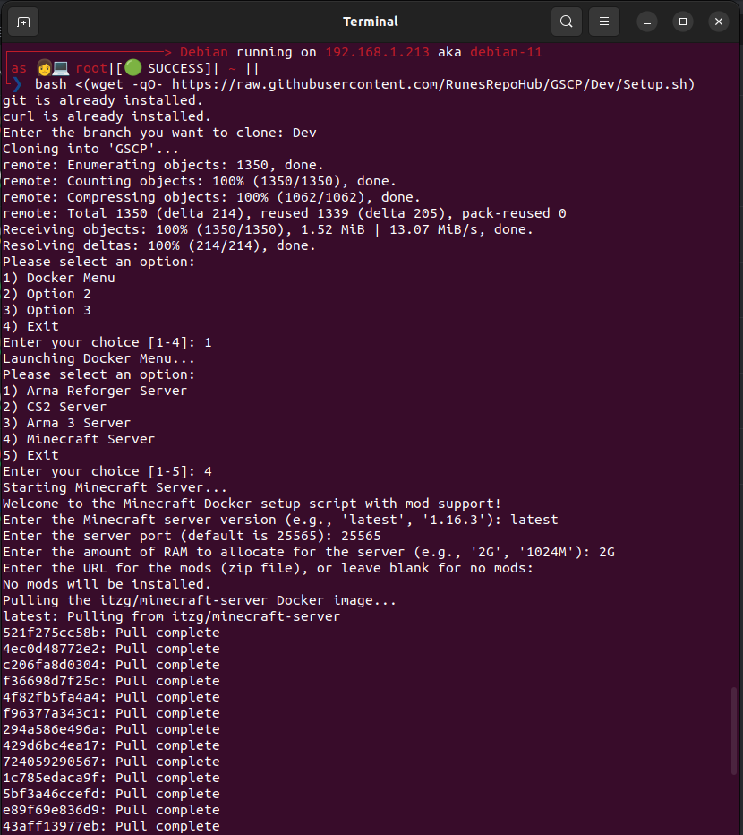
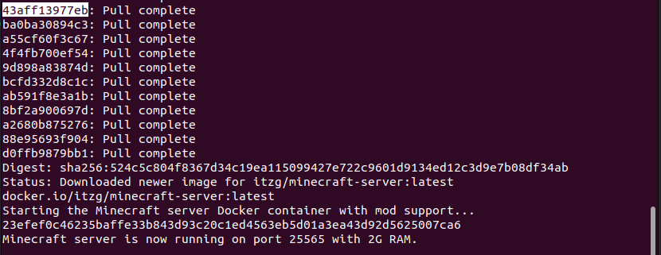

# GSCP
Game Server Control Panel, this is an easy way to deploy and manage docker game servers.

## OS Support: (Tested)

* Debian 11

## Game Support:

* Arma 3
* Arma Reforger
* CS 2
* Minecraft

## How to use





Run the setup via the command below.

Follow the setup "guide" after.

When asked what branch do you want to use, select the branch you want to use. The default is the "Dev" branch. But if you want to use a stable branch, select "Prod".

If you want to the nightly updated code base, then use the "PoC" branch.

```
bash <(wget -qO- https://raw.githubusercontent.com/RunesRepoHub/GSCP/Dev/Setup.sh)
```

### Custom Commands 

If you want to access the script again after exiting it use the command below.

```
main-menu
```

## To Do list

Features and functions planned but not added yet.

[To-Do List](Docs/To-do-list.md)
